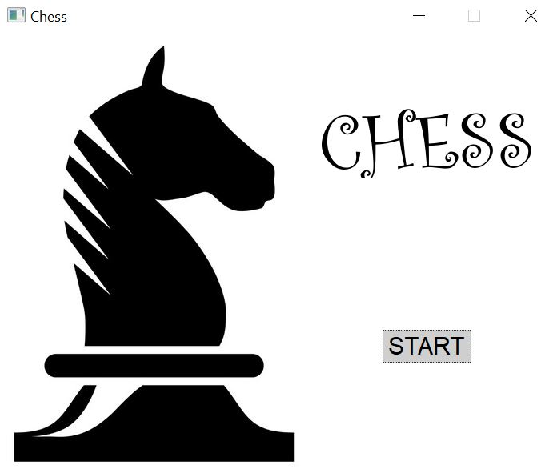

# C++ Projects
## 1. Password Defender
 An application helping users to manage their accounts and passwords locally. RSA cryptosystem is used to encode the data.
 
  

## 2. Chess Game Simulator
A game where two users could play chess against each other. Chess Judge is implemented.

  

## 3. Pipe Game
A game asking users to connect all the shuffled pipe blocks so that there is no leakage. BFS is applied to check the connectivity of the pipes.

 
